# micropython-lcd160gui

V0.11 21st Feb 2017

Provides a simple touch driven event based GUI interface for the Pyboard when
used with the official LCD160CR colour display. It is based on the official
driver and uses uasyncio for scheduling.

It is targeted at hardware control and display applications. GUI objects are
drawn using graphics primitives rather than by rendering bitmap images. This
ensures that they are scalable. The API is via event driven callbacks.

The library can use the fonts internal to the device and also arbitrary fonts
converted from ``ttf`` or ``otf`` formats.

An extension for plotting simple graphs is described [here](./LPLOT.md).

**Caveat** The official driver ``lcd160cr.py`` should be dated 21st Feb 2017
or later: use firmware dated on or after 22nd Feb 2017 or build from source.
Issue #2879 is due to be resolved with a display firmware update; in the
meantime the detection of long button presses is unreliable.

Images from the supplied test programs:

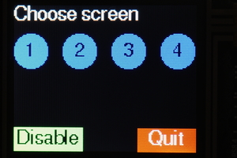 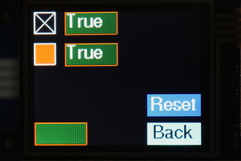  
Screen selection buttons. Two styles of checkboxes.  

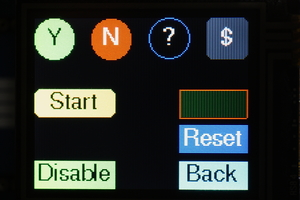 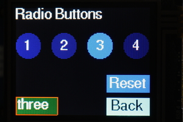  
Assorted pushbutton styles. Radio buttons (1 of N selection).  

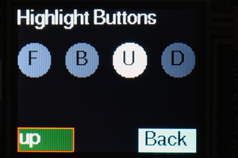  
Highlight buttons change color for a period after touching.  

 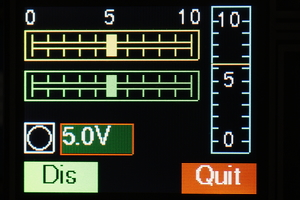  
Slider controls allow control and display of float values. Also Meter, LED
and Dial displays.   

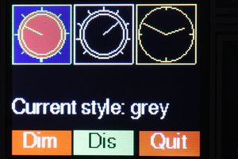  
Rotary controls and displays - ``lkt.py`` demonstrates the two styles of
"greying out" disabled controls.  

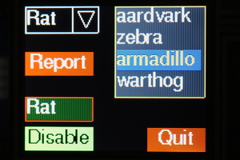 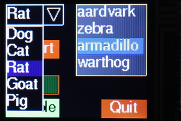  
Listbox and dropdown list objects (image on right shows dropdown opened).  

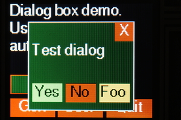  
A modal dialog box.  

 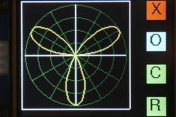  
The Plot module: Cartesian and polar graphs.

# Contents

1. [Pre requisites](./README.md#1-pre-requisites)

  1.1 [Pre installation](./README.md#11-pre-installation)

  1.2 [Library Documentation](./README.md#12-library-documentation)

  1.3 [Python files](./README.md#13-python-files)

2. [Concepts](./README.md#2-concepts)

  2.1 [Terminology](./README.md#21-terminology)

  2.2 [Coordinates](./README.md#22-coordinates)

  2.3 [Colors](./README.md#23-colors)

  2.4 [Callbacks](./README.md#24-callbacks)

  2.5 [Screens](./README.md#25-screens)

3. [Program Structure](./README.md#3-program-structure)

  3.1 [Initialisation](./README.md#31-initialisation)

4. [Class Screen](./README.md#4-class-screen)

5. [Display Classes](./README.md#5-display-classes)

  5.1 [Class Label](./README.md#51-class-label)

  5.2 [Class Dial](./README.md#52-class-dial)

  5.3 [Class LED](./README.md#53-class-led)

  5.4 [Class Meter](./README.md#54-class-meter)

6. [Control Classes](./README.md#6-control-classes)

  6.1 [Class Slider](./README.md#61-class-slider)

  6.2 [Class Knob](./README.md#62-class-knob)

  6.3 [Class Checkbox](./README.md#63-class-checkbox)

  6.4 [Class Button](./README.md#64-class-button)

  6.5 [Class ButtonList: emulate a button with multiple states](./README.md#65-class-buttonlist-emulate-a-button-with-multiple-states)

  6.6 [Class RadioButtons](./README.md#66-class-radiobuttons)

  6.7 [Class Listbox](./README.md#67-class-listbox)

  6.8 [Class Dropdown](./README.md#68-class-dropdown)

7. [Dialog Boxes](./README.md#7-dialog-boxes)

  7.1 [Class Aperture](./README.md#71-class-aperture)

  7.2 [Class DialogBox](./README.md#72-class-dialogbox)

8. [Fonts](./README.md#8-fonts)

  8.1 [External fonts](./README.md#81-external-fonts)

  8.2 [Internal fonts: Class IFont](./README.md#82-internal-fonts-class-ifont)

# 1. Pre requisites

## 1.1 Pre installation

Before running the GUI the hardware should be tested by working through the
[tutorial](https://docs.micropython.org/en/latest/pyboard/pyboard/tutorial/lcd160cr_skin.html).

Owing to the size of the library and depending on the size of your application
it may be necessary to freeze modules as bytecode. Users should therefore be
familiar with building Micropython from source, and installing Python modules
as persistent bytecode. Instructions on doing this may be found
[here](http://forum.micropython.org/viewtopic.php?f=6&t=1776).

Familiarity with callbacks and event driven programming will assist in developing
applications.

## 1.2 Library Documentation

Documentation for the underlying libraries may be found at these sites.  

[lcd160cr driver](http://docs.micropython.org/en/latest/pyboard/library/lcd160cr.html#touch-screen-methods)  
[Installing the uasyncio library](https://github.com/micropython/micropython-lib) Run
the Unix build and issue ``upip install micropython-uasyncio``. The library can then
be found at ~/.micropython/lib).

Other references:  
[Proposed standard font format](https://github.com/peterhinch/micropython-font-to-py)  
[uasyncio libraries and notes](https://github.com/peterhinch/micropython-async)  

## 1.3 Python files

Library directory:
 1. The uasyncio library may be copied to the Pyboard or flashed as frozen
 bytecode. To do this copy ``lib\*`` containing the uasyncio installation to
 your frozen modules directory and build.

Core files:
 1. ``asyn.py`` Synchronisation primitives.
 2. ``aswitch.py`` Provides a ``Delay_ms`` class for retriggerable delays.
 3. ``lcd160_gui.py`` The micro GUI library.
 4. ``lcd_local.py`` Local hardware definition. This file should be edited to
 match your hardware.
 5. ``constants.py`` Constants such as colors and shapes (import using
 ``from constants import *``).

Optional files used by test programs:
 1. ``font6.py`` Font file.
 2. ``font10.py`` Ditto.
 3. ``font14.py`` Ditto. These are generated from the free font FreeSans.ttf.

Test/demo programs:
 1. ``lvst.py`` A test program for vertical linear sliders. Also demos an
 asynchronous coroutine and linked sliders.
 2. ``lhst.py`` Tests horizontal slider controls, meter and LED. Demos
 asynchronous coroutine, linked sliders and dynamically changing object colors.
 3. ``lbt.py`` Pushbuttons, radio buttons, highlighting buttons and checkboxes.
 "Reset" buttons respond to short and long presses.
 4. ``lkt.py`` Rotary controls. Shows the two styles of "greying out" of
 disabled controls.
 5. ``ldd.py`` Dropdown list and Listbox controls.
 6. ``ldb.py`` Modal dialog boxes.
 7. ``ldb_if.py`` As above but using an internal font.

By the standards of the Pyboard this is a large library. The ``lcd160_gui.py``
program is too large to be compiled on-board and must be cross-compiled. The
test programs have been run with a standard firmware build. If memory problems
are encountered Python code (including font files) may be implemented as frozen
bytecode.

It is also wise to issue ctrl-D to soft reset the Pyboard before importing a
module which uses the library. The test programs require a ctrl-D before import.

######[Jump to Contents](./README.md#contents)

# 2. Concepts

## 2.1 Terminology

GUI objects are created on a ``Screen`` instance which normally fills the
entire physical screen. Displayable GUI objects comprise ``control`` and
``display`` instances. The former can respond to touch (e.g. ``Pushbutton``
instances) while the latter cannot (``LED`` or ``Dial`` instances).

## 2.2 Coordinates

In common with most displays, the top left hand corner of the display is (0, 0)
with increasing values of x to the right, and increasing values of y downward.
Display objects exist within a rectangular bounding box; in the case of touch
sensitive controls this corresponds to the sensitive region. Locations are
defined as a 2-tuple (x, y). The location of an object is defined as the
location of the top left hand corner of the bounding box.

## 2.3 Colors

These are defined as a 3-tuple (r, g, b) with values of red, green and blue in
range 0 to 255. The interface and this document uses the American spelling
(color) throughout. This is for historical reasons.

## 2.4 Callbacks

The interface is event driven. Controls may have optional callbacks which will
be executed when a given event occurs. A callback function receives positional
arguments. The first is a reference to the object raising the callback.
Subsequent arguments are user defined, and are specified as a tuple or list of
items. Callbacks are optional, as are the argument lists - a default null
function and empty list are provided. Callbacks are usually bound methods - see
the Screens section for a reason why this is useful.

All controls and displays have a ``tft`` property which is the ``LCD160CR_G``
instance. This enables callbacks to access drawing primitives.

## 2.5 Screens

GUI controls and displays are rendered on a ``Screen`` instance. A user program
may instantiate multiple screens, each with its own set of GUI objects. The
``Screen`` class has class methods enabling runtime changes of the screen to be
rendered to the physical display. This enables nested screens. The feature is
demonstrated in ``lbt.py``.

Applications should be designed with a ``Screen`` subclass for each of the
application's screens (even if the app uses only a single screen). This
faciitates sharing data between GUI objects on a screen, and simplifies the
handling of control callbacks. These will be methods bound to the user screen.
They can access the screen's bound variables via ``self`` and the control's
bound methods via the callback's first argument (which is a reference to the
control). Again ``lbt.py`` provides examples.

The ``Screen`` class has 3 null methods which may be implemented in subclasses:
``on_open`` which runs when a screen is opened but prior to its display,
``after_open`` which is called after display, and ``on_hide`` which runs when a
screen change is about to make the screen disappear. These may be used to
instantiate or control threads and to retrieve the results from a modal dialog
box.

The ``Screen`` class is configured in ``lcd_local.py``.

######[Jump to Contents](./README.md#contents)

# 3. Program Structure

The following illustrates the structure of a minimal program:
```python
from lcd_local import setup
import font10
from constants import *
from lcd160_gui import Screen, Button
def quitbutton():
    def quit(button):
        Screen.shutdown()
    Button((109, 107), font = font10, callback = quit, fgcolor = RED,
           text = 'Quit', shape = RECTANGLE)

class BaseScreen(Screen):
    def __init__(self):
        super().__init__()
        quitbutton()
setup()
Screen.change(BaseScreen)
```

The last line causes the Screen class to instantiate your ``BaseScreen`` and to
start the scheduler using that screen object. Control then passes to the
scheduler: the code following this line will not run until the GUI is shut down
and the scheduler is stopped (``Screen.shutdown()``).

## 3.1 Initialisation

This is performed by ``lcd_local.py`` which instantiates an ``LCD160CR_G``
display. This class is derived from the official driver's ``LCD160CR`` class:
the documentation for the latter may be viewed
[here](http://docs.micropython.org/en/latest/pyboard/library/lcd160cr.html#lcd160cr.LCD160CR.set_spi_win).
An additional optional constructor keyword argument ``bufsize`` is available.
See section 8 (Fonts) for its use.

######[Jump to Contents](./README.md#contents)

# 4. Class Screen

The ``Screen`` class presents a full-screen canvas onto which displayable
objects are rendered. Before instantiating GUI objects a ``Screen`` instance
must be created. This will be current until another is instantiated. When a GUI
object is instantiated it is associated with the current screen.

The best way to use the GUI, even in single screen programs, is to create a
user screen by subclassing the ``Screen`` class. GUI objects are instantiated
in the constructor. This arrangement facilitates communication between objects
on the screen. The following presents an outline of this approach:

```python
from lcd_local import setup
import font10
from constants import *
from lcd160_gui import Screen, Button, Label
def backbutton(x, y):
    def back(button):
        Screen.back()
    Button((x, y), font = font10, fontcolor = BLACK, callback = back,
           fgcolor = CYAN,  text = 'Back')

def fwdbutton(x, y, cls_screen, text='Next'):
    def fwd(button):
        Screen.change(cls_screen)
    Button((x, y), font = font10, callback = fwd, fgcolor = RED, text = text)

def quitbutton():
    def quit(button):
        Screen.shutdown()
    Button((109, 107), font = font10, callback = quit, fgcolor = RED, text = 'Quit')

class Screen_1(Screen):
    def __init__(self):
        super().__init__()
        Label((0, 0), font = font10, value = 'Test screen 1')
        backbutton(0, 100)

class Screen_0(Screen):
    def __init__(self):
        super().__init__()
        Label((0, 0), font = font10, value = 'Test screen 0')
        fwdbutton(0, 107, Screen_1)
        quitbutton()
setup()
Screen.change(Screen_0)
```

Note that the GUI is started by issuing ``Screen.change`` with the class as its
argument rather than an instance. This aims to minimise RAM usage.

## 4.1 Class methods

In normal use the following methods only are required:  
 * ``change`` Change screen, refreshing the display. Mandatory positional
 argument: the new screen class name. This must be a class subclassed from
 ``Screen``. The class will be instantiated and displayed. Optional keyword
 arguments: ``args``, ``kwargs``. These enable passing positional and keyword
 arguments to the constructor of the new screen.
 * ``back`` Restore previous screen.
 * ``shutdown`` Clear the screen and shut down the GUI.
 * ``set_grey_style`` Sets the way in which disabled ('greyed-out') objects are
 displayed. The colors of disabled objects are dimmed by a factor and
 optionally desaturated (turned to shades of grey). Optional keyword arguments:
 ``desaturate`` default ``True`` and ``factor`` default 2. A ``ValueError``
 will result if ``factor`` is <= 1. The default style is to desaturate and dim
 by a factor of 2.

Other method:  
 * ``get_tft`` Return the ``LCD160CR`` instance. This allows direct drawing to
 the physical screen. Anything so drawn will be lost when the screen is
 changed. In normal use the ``TFT`` instance is acquired via a GUI object's
 ``tft`` property.

See ``lbt.py`` and ``ldb.py`` for examples of multi-screen design.

## 4.2 Constructor

This takes no arguments.

## 4.3 Callback Methods

These do nothing, and may be defined in subclasses if required.

 * ``on_open`` Called when a screen is instantiated but prior to display.
 * ``after_open`` Called after a screen has been displayed.
 * ``on_hide`` Called when a screen ceases to be current.

######[Jump to Contents](./README.md#contents)

# 5. Display Classes

These classes provide ways to display data and are not touch sensitive.

## 5.1 Class Label

Displays text in a fixed length field. The height of a label is determined by
the metrics of the specified font.

Constructor mandatory positional argument:
 1. ``location`` 2-tuple defining position.

Keyword only arguments:  
 * ``font`` Mandatory. Font object to use.
 * ``width`` The width of the object in pixels. Default: ``None`` - width is
 determined from the dimensions of the initial text.
 * ``border`` Border width in pixels - typically 2. If omitted, no border will
 be drawn.
 * ``fgcolor`` Color of border. Defaults to system color.
 * ``bgcolor`` Background color of object. Defaults to system background.
 * ``fontcolor`` Text color. Defaults to system text color.
 * ``value`` Initial text. Default: ``None``.

Method:
 * ``value`` Argument ``val`` string, default ``None``. If provided, refreshes
 the label with the passed text otherwise clears the text in the label.

######[Jump to Contents](./README.md#contents)

## 5.2 Class Dial

Displays angles in a circular dial. Angles are in radians with zero represented
by a vertical pointer. Positive angles appear as clockwise rotation of the
pointer. The object can display multiple angles using pointers of differing
lengths (like a clock face).

Constructor mandatory positional argument:
 1. ``location`` 2-tuple defining position.

Keyword only arguments (all optional):  
 * ``height`` Dimension of the square bounding box. Default 50 pixels.
 * ``fgcolor`` Color of border. Defaults to system color.
 * ``bgcolor`` Background color of object. Defaults to system background.
 * ``border`` Border width in pixels - typically 2. If omitted, no border will
 be drawn.
 * ``pointers`` Tuple of floats in range 0 to 0.9. Defines the length of each
 pointer as a  proportion of the dial diameter. Default (0.9,) i.e. one pointer
 of length 0.9.
 * ``ticks`` Defines the number of graduations around the dial. Default 4.

Method:
 * ``value`` Arguments: ``angle`` (mandatory), ``pointer`` (optional) the
 pointer index. Displays  an angle. A ``ValueError`` will be raised if the
 pointer index exceeds the number of pointers defined by the constructor
 ``pointers`` argument.

######[Jump to Contents](./README.md#contents)

## 5.3 Class LED

Displays a boolean state. Can display other information by varying the color.

Constructor mandatory positional argument:
 1. ``location`` 2-tuple defining position.

Keyword only arguments (all optional):
 * ``height`` Dimension of the square bounding box. Default 20 pixels.
 * ``fgcolor`` Color of border. Defaults to system color.
 * ``bgcolor`` Background color of object. Defaults to system background.
 * ``border`` Border width in pixels - default 2. If ``None``, no border will
 be drawn.
 * ``color`` The color of the LED. Default RED.

Methods:
 * ``value`` Argument ``val`` boolean, default ``None``. If provided, lights or
 extinguishes the LED. Always returns its current state.
 * ``color`` Argument ``color``. Change the LED color without altering its
 state.

######[Jump to Contents](./README.md#contents)

## 5.4 Class Meter

This displays a single value in range 0.0 to 1.0 on a vertical linear meter.

Constructor mandatory positional argument:
 1. ``location`` 2-tuple defining position.

Keyword only arguments:
 * ``height`` Dimension of the bounding box. Default 100 pixels.
 * ``width`` Dimension of the bounding box. Default 26 pixels.
 * ``font`` Font to use in any legends. Default: ``None`` No legends will be
 displayed.
 * ``legends`` A tuple of strings to display on the centreline of the meter.
 These should be short to physically fit. They will appear equidistant along
 the vertical scale, with string 0 at the bottom. Default ``None``: no legends
 will be shown.
 * ``divisions`` Count of graduations on the meter scale. Default 10.
 * ``fgcolor`` Color of border. Defaults to system color.
 * ``bgcolor`` Background color of object. Defaults to system background.
 * ``fontcolor`` Text color. Defaults to system text color.
 * ``pointercolor`` Color of meter pointer. Defaults to ``fgcolor``.
 * ``value`` Initial value to display. Default 0.

Methods:
 * ``value`` Optional argument ``val``. If provided, refreshes the meter
 display with a new value. Range 0.0 to 1.0: out of range values will be
 constrained to full scale or 0. Always returns its current value. 

######[Jump to Contents](./README.md#contents)


# 6. Control Classes

These classes provide touch-sensitive objects capable of both the display and
entry of data. If the user moves the control, its value will change and an
optional callback will be executed. If another control's callback or a
coroutine alters a control's value, its appearance will change accordingly.

## 6.1 Class Slider

These emulate linear potentiometers. Vertical ``Slider`` and horizontal
``HorizSlider`` variants are available. These are constructed and used
similarly. The short forms (v) or (h) are used below to identify these
variants. See the note above on callbacks.

Constructor mandatory positional argument:
 1. ``location`` 2-tuple defining position.

Optional keyword only arguments:
 * ``font`` Font to use for any legends. Default ``None``: no legends will be
 drawn.
 * ``height`` Dimension of the bounding box. Default 120 pixels (v), 20 (h).
 * ``width`` Dimension of the bounding box. Default 20 pixels (v), 120 (h).
 * ``divisions`` Number of graduations on the scale. Default 10.
 * ``legends`` A tuple of strings to display near the slider. These ``Label``
 instances will be  distributed evenly along its length, starting at the bottom
 (v) or left (h).
 * ``fgcolor`` Color of foreground (the control itself). Defaults to system
 color.
 * ``bgcolor`` Background color of object. Defaults to system background.
 * ``fontcolor`` Text color. Defaults to system text color.
 * ``slidecolor`` Color for the slider. Defaults to the foreground color.
 * ``border`` Width of border. Default ``None``: no border will be drawn. If a
 value (typically 2) is provided, a border line will be drawn around the
 control.
 * ``cb_end`` Callback function which will run when the user stops touching the
 control.
 * ``cbe_args`` A list/tuple of arguments for above callback. Default ``[]``.
 * ``cb_move`` Callback function which will run when the user moves the slider
 or the value is changed programmatically.
 * ``cbm_args`` A list/tuple of arguments for above callback. Default ``[]``.
 * ``value`` The initial value. Default 0.0: slider will be at the bottom (v),
 left (h).

Methods:
 * ``greyed_out`` Optional boolean argument ``val`` default ``None``. If
 ``None`` returns the current 'greyed out' status of the control. Otherwise
 enables or disables it, showing it in its new state.
 * ``value`` Optional arguments ``val`` (default ``None``). If supplied the
 slider moves to reflect the new value and the ``cb_move`` callback is
 triggered. The method constrains the range to 0.0 to 1.0. Always returns the
 control's value.
 * ``color`` Mandatory arg ``color`` The control is rendered in the selected
 color. This supports dynamic color changes  

######[Jump to Contents](./README.md#contents)

## 6.2 Class Knob

This emulates a rotary control capable of being rotated through a predefined
arc.

Constructor mandatory positional argument:
 1. ``location`` 2-tuple defining position.

Optional keyword only arguments:
 * ``height`` Dimension of the square bounding box. Default 50 pixels.
 * ``arc`` Amount of movement available. Default 2*PI radians (360 degrees).
 * ``ticks`` Number of graduations around the dial. Default 9.
 * ``fgcolor`` Color of foreground (the control itself). Defaults to system
 color.
 * ``bgcolor`` Background color of object. Defaults to system background.
 * ``color`` Fill color for the control knob. Default: no fill.
 * ``border`` Width of border. Default ``None``: no border will be drawn. If a
 value (typically 2) is provided, a border line will be drawn around the
 control.
 * ``cb_end`` Callback function which will run when the user stops touching the
 control.
 * ``cbe_args`` A list/tuple of arguments for above callback. Default ``[]``.
 * ``cb_move`` Callback function which will run when the user moves the knob or
 the value is changed.
 * ``cbm_args`` A list/tuple of arguments for above callback. Default ``[]``.
 * ``value`` Initial value. Default 0.0: knob will be at its most
 counter-clockwise position.

Methods:
 * ``greyed_out`` Optional boolean argument ``val`` default ``None``. If
 ``None`` returns the current 'greyed out' status of the control. Otherwise
 enables or disables it, showing it in its new state.
 * ``value`` Optional argument ``val``. If set, adjusts the pointer to
 correspond to the new value. The move callback will run. The method constrains
 the range to 0.0 to 1.0. Always returns the control's value.

######[Jump to Contents](./README.md#contents)

## 6.3 Class Checkbox

This provides for boolean data entry and display. In the ``True`` state the
control can show an 'X' or a filled block of any color.

Constructor mandatory positional argument:
 1. ``location`` 2-tuple defining position.

Optional keyword only arguments:
 * ``height`` Dimension of the square bounding box. Default 20 pixels.
 * ``fillcolor`` Fill color of checkbox when ``True``. Default ``None``: an 'X'
 will be drawn.
 * ``fgcolor`` Color of foreground (the control itself). Defaults to system
 color.
 * ``bgcolor`` Background color of object. Defaults to system background.
 * ``border`` Width of border. Default ``None``: no border will be drawn. If a
 value (typically 2) is provided, a border line will be drawn around the
 control.
 * ``callback`` Callback function which will run when the value changes.
 * ``args`` A list/tuple of arguments for above callback. Default ``[]``.
 * ``value`` Initial value. Default ``False``.

Methods:
 * ``greyed_out`` Optional boolean argument ``val`` default ``None``. If
 ``None`` returns the current 'greyed out' status of the control. Otherwise
 enables or disables it, showing it in its new state.
 * ``value`` Optional boolean argument ``val``. If the provided value does not
 correspond to the control's current value, updates it; the checkbox is
 re-drawn and the callback executed. Always returns the control's value.

######[Jump to Contents](./README.md#contents)

## 6.4 Class Button

This emulates a pushbutton, with a callback being executed each time the button
is pressed. Buttons may be any one of three shapes: ``CIRCLE``, ``RECTANGLE``
or ``CLIPPED_RECT``.

Constructor mandatory positional argument:
 1. ``location`` 2-tuple defining position.

Mandatory keyword only argument:
 * ``font`` Font for button text

Optional keyword only arguments:
 * ``shape`` CIRCLE, RECTANGLE or CLIPPED_RECT. Default RECTANGLE.
 * ``height`` Height of the bounding box. Default 20 pixels.
 * ``width`` Width of the bounding box. Default 50 pixels.
 * ``fill`` Boolean. If ``True`` the button will be filled with the current
 ``fgcolor``.
 * ``fgcolor`` Color of foreground (the control itself). Defaults to system
 color.
 * ``bgcolor`` Background color of object. Defaults to system background.
 * ``fontcolor`` Text color. Defaults to system text color.
 * ``litcolor`` If provided the button will display this color for one second
 after being pressed.
 * ``text`` Shown in centre of button. Default: an empty string.
 * ``callback`` Callback function which runs when button is pressed.
 * ``args`` A list/tuple of arguments for the above callback. Default ``[]``.
 * ``onrelease`` Default ``True``. If ``True`` the callback will occur when the
 button is released otherwise it will occur when pressed.
 * ``lp_callback`` Callback to be used if button is to respond to a long press.
 Default ``None``.
 * ``lp_args`` A list/tuple of arguments for above callback. Default ``[]``.

Method:
 * ``greyed_out`` Optional boolean argument ``val`` default ``None``. If
 ``None`` returns the current 'greyed out' status of the control. Otherwise
 enables or disables it, showing it in its new state.

Class variables:
 * ``lit_time`` Period in seconds the ``litcolor`` is displayed. Default 1.
 * ``long_press_time`` Press duration for a long press. Default 1 second.

######[Jump to Contents](./README.md#contents)

## 6.5 Class ButtonList emulate a button with multiple states

A ``ButtonList`` groups a number of buttons together to implement a button
which changes state each time it is pressed. For example it might toggle
between a green Start button and a red Stop button. The buttons are defined and
added in turn to the ``ButtonList`` object. Typically they will be the same
size, shape and location but will differ in color and/or text. At any time just
one of the buttons will be visible, initially the first to be added to the
object.

Buttons in a ``ButtonList`` should not have callbacks. The ``ButtonList`` has
its own user supplied callback which will run each time the object is pressed.
However each button can have its own list of ``args``. Callback arguments
comprise the currently visible button followed by its arguments.

Constructor argument:
 * ``callback`` The callback function. Default does nothing.

Methods:
 * ``add_button`` Adds a button to the ``ButtonList``. Arguments: as per the
 ``Button`` constructor.
 Returns the button object.
 * ``greyed_out`` Optional boolean argument ``val`` default ``None``. If
 ``None`` returns the current 'greyed out' status of the control. Otherwise
 enables or disables it, showing it in its new state.
 * ``value`` Optional argument: a button in the set. If supplied and the button
 is not active the currency changes to the supplied button and its callback is
 run. Always returns the active button.

Typical usage is as follows:
```python
def callback(button, arg):
    print(arg)

table = [
     {'fgcolor' : GREEN, 'shape' : CLIPPED_RECT, 'text' : 'Start', 'args' : ['Live']},
     {'fgcolor' : RED, 'shape' : CLIPPED_RECT, 'text' : 'Stop', 'args' : ['Die']},
]
bl = ButtonList(callback)
for t in table: # Buttons overlay each other at same location
    bl.add_button((10, 10), font = font14, fontcolor = BLACK, **t)
```

######[Jump to Contents](./README.md#contents)

## 6.6 Class RadioButtons

These comprise a set of buttons at different locations. When a button is
pressed, it becomes highlighted and remains so until another button is pressed.
A callback runs each time the current button is changed.

Constructor positional arguments:
 * ``highlight`` Color to use for the highlighted button. Mandatory.
 * ``callback`` Callback when a new button is pressed. Default does nothing.
 * ``selected`` Index of initial button to be highlighted. Default 0.

Methods:
 * ``add_button`` Adds a button. Arguments: as per the ``Button`` constructor.
 Returns the Button instance.
 * ``greyed_out`` Optional boolean argument ``val`` default ``None``. If
 ``None`` returns the current 'greyed out' status of the control. Otherwise
 enables or disables it, showing it in its new state.
 * ``value`` Optional argument: a button in the set. If supplied, and the
 button is not currently active, the currency changes to the supplied button
 and its callback is run. Always returns the currently active button.

Typical usage:
```python
def callback(button, arg):
    print(arg)

table = [
    {'text' : '1', 'args' : ['1']},
    {'text' : '2', 'args' : ['2']},
    {'text' : '3', 'args' : ['3']},
    {'text' : '4', 'args' : ['4']},
]
x = 0
rb = RadioButtons(callback, BLUE) # color of selected button
for t in table:
    rb.add_button((x, 180), font = font14, fontcolor = WHITE,
                    fgcolor = LIGHTBLUE, height = 40, **t)
    x += 60 # Horizontal row of buttons
```

######[Jump to Contents](./README.md#contents)

## 6.7 Class Listbox

The height of a listbox is determined by the number of entries in it and the
font in use. Scrolling is not supported.

Constructor mandatory positional argument:
 1. ``location`` 2-tuple defining position.

Mandatory keyword only arguments:
 * ``font``
 * ``elements`` A list or tuple of strings to display. Must have at least one
 entry.

Optional keyword only arguments:
 * ``width`` Control width in pixels, default 80.
 * ``value`` Index of currently selected list item. Default 0.
 * ``border`` Space between border and contents. Default 2 pixels. If ``None``
 no border will be drawn.
 * ``fgcolor`` Color of foreground (the control itself). Defaults to system
 color.
 * ``bgcolor`` Background color of object. Defaults to system background.
 * ``fontcolor`` Text color. Defaults to system text color.
 * ``select_color`` Background color for selected item in list. Default
 ``LIGHTBLUE``.
 * ``callback`` Callback function which runs when a list entry is picked.
 * ``args`` A list/tuple of arguments for above callback. Default ``[]``.

Methods:
 * ``value`` Argument ``val`` default ``None``. If the argument is provided
 which is a valid index into the list that entry becomes current and the
 callback is executed. Always returns the index of the currently active entry.
 * ``textvalue`` Argument ``text`` a string default ``None``. If the argument
 is provided and is in the control's list, that item becomes current. Returns
 the current string, unless the arg was provided but did not correspond to any
 list item. In this event the control's state is not changed and ``None`` is
 returned.

The callback is triggered whenever a listbox item is pressed, even if that item
is already currently selected.

######[Jump to Contents](./README.md#contents)

## 6.8 Class Dropdown

A dropdown list. The list, when active, is drawn below the control. The height
of the control is determined by the height of the font in use. The height of
the list is determined by the number of entries in it and the font in use.
Scrolling is not supported.

Constructor mandatory positional argument:
 1. ``location`` 2-tuple defining position.

Mandatory keyword only arguments:
 * ``font``
 * ``elements`` A list or tuple of strings to display. Must have at least one
 entry.

Optional keyword only arguments:
 * ``width`` Control width in pixels, default 100.
 * ``value`` Index of currently selected list item. Default 0.
 * ``fgcolor`` Color of foreground (the control itself). Defaults to system
 color.
 * ``bgcolor`` Background color of object. Defaults to system background.
 * ``fontcolor`` Text color. Defaults to system text color.
 * ``select_color`` Background color for selected item in list. Default
 ``LIGHTBLUE``.
 * ``callback`` Callback function which runs when a list entry is picked.
 * ``args`` A list/tuple of arguments for above callback. Default ``[]``.

Methods:
 * ``value`` Argument ``val`` default ``None``. If the argument is provided
 which is a valid index into the list that entry becomes current and the
 callback is executed. Always returns the index of the currently active entry.
 * ``textvalue`` Argument ``text`` a string default ``None``. If the argument
 is provided and is in the control's list, that item becomes current. Returns
 the current string, unless the arg was provided but did not correspond to any
 list item. In this event the control's state is not changed and ``None`` is
 returned.

The callback is triggered if an item on the dropdown list is touched and that
item is not currently selected (i.e. when a change occurs).

######[Jump to Contents](./README.md#contents)

# 7. Dialog Boxes

In general ``Screen`` objects occupy the entire physical display. The principal
exception to this is modal dialog boxes which are rendered in a window which
accepts all touch events until it is closed. Dialog boxes are created by
instantiating an ``Aperture`` which is a ``Screen`` superclass. In effect this
is a window, but a 'micro' implementation lacking chrome beyond a simple border
and occupying a fixed location on the screen.

In use the user program creates a class subclassed from ``Aperture``. This is
populated in the same way as per ``Screen`` subclasses. The class name can then
be passed to ``Screen.change`` to invoke the dialog box. The GUI provides a
simple way to build dialog boxes based on a small set of pushbuttons such as
'Yes/No/Cancel' in the form of the ``DialogBox`` class.

A convenience method ``locn`` is provided to assist in populating dialog boxes.
Given coordinates relative to the dialog box, it provides an absolute
``location`` 2-tuple suitable as a constructor argument for ``control`` or
``display`` classes. See ``ldb.py`` for example usage.

######[Jump to Contents](./README.md#contents)

## 7.1 Class Aperture

Provides a window for objects in a modal dialog box.

Constructor mandatory positional args:  
 1. ``location`` 2-tuple defining the window position.
 2. ``height`` Dimensions in pixels.
 3. ``width``

Optional keyword only args:  
 * ``draw_border`` Boolean, default ``True``. If set a single pixel window
 border will be drawn.
 * ``bgcolor``  Background color of window. Defaults to system background.
 * ``fgcolor`` Color of border. Defaults to system foreground.

Instance variables:  
 * ``location`` 2-tuple defining the window position.
 * ``height`` Dimensions in pixels.
 * ``width``

Method:
 * ``locn`` Args: x, y. Returns an absolute location 2-tuple given a pair of
 coordinates relative to the dialog box.

Class method:  
 * ``value`` Optional arg ``val`` default ``None``. Provides a mechanism for
 returning the outcome of a dialog box which can be queried by the calling
 object. If the arg is provided, the value is set. The arg may be any Python
 object. Returns the value of the ``Aperture`` class. The calling ``Screen``
 can query this by implementing an ``on_open`` method which calls
 ``Aperture.value()`` (see ``ldb.py``).

######[Jump to Contents](./README.md#contents)

## 7.2 Class DialogBox

Eases building a dialog box subset based on a row of pushbuttons. Any button
press will close the dialog. The caller can determine which button was pressed.
The size of the buttons and the width of the dialog box are calculated from the
strings assigned to the buttons. This ensures that buttons are evenly spaced
and identically sized.

Constructor mandatory positional args:
 1. ``font`` The font for buttons and label.
 
Optional keyword only args:  
 * ``elements`` A list or tuple of 2-tuples. Each defines the text and color of
 a pushbutton, e.g. ``(('Yes', RED), ('No', GREEN))``.
 * ``location`` 2-tuple defining the dialog box location. Default (20, 20).
 * ``label`` Text for an optional label displayed in the centre of the dialog
 box. Default ``None``.
 * ``bgcolor`` Background color of window. Default ``DARKGREEN``.
 * ``buttonwidth`` Minimum width of buttons. Default 25. In general button
 dimensions are calculated from the size of the strings in ``elements``.  
 * ``closebutton`` Boolean. If set, a ``close`` button will be displayed at the
 top RH corner of the dialog box.

Pressing any button closes the dialog and sets the ``Aperture`` value to the
text of the button pressed or 'Close' in the case of the ``close`` button.

######[Jump to Contents](./README.md#contents)

# 8. Fonts

The LCD160CR contains internal fixed pitch fonts. These may be used as an
alternative to external fonts converted from ``ttf`` or ``otf`` files and are
likely to result in better text rendering at small sizes. External fonts enable
arbitrary fonts to be used including ones with variable pitch.

## 8.1 External fonts

Fonts may be created using the ``font_to_py.py`` utility documented
[here](https://github.com/peterhinch/micropython-font-to-py.git). The ``-x``
argument should be employed. The resultant Python file may be imported and
the module passed to the constructor of GUI objects. These files may be
frozen as bytecode to radically reduce RAM usage.

The ``LCD160CR_G`` constructor has an optional constructor keyword argument
``bufsize``. This defines the size of an internal character buffer, required if
using external fonts. If an application's largest external font has dimensions
``h*w`` pixels, the buffer must be at least ``h*w*2`` bytes in size. The
default of 1058 bytes provides for external fonts up to 23 by 23 pixels.

A ``UguiException`` will be raised if an application attempts to use a font too
large for the buffer.

######[Jump to Contents](./README.md#contents)

## 8.2 Internal fonts Class IFont

To use internal fonts an ``IFont`` is instantiated. The instance is then passed
to GUI constructors in the same way as for external fonts. See test program
``ldb_if.py`` for an example.

Constructor mandatory positional arg:
 * ``family`` 0 to 3. Determines the size of the font.

Optional args:
 * ``scale`` Pixels are drawn as a square with side length equal to scale + 1.
 The value can be between 0 and 63 (default 0).
 * ``bold_h`` Controls the number of pixels to overdraw each character pixel in
 the horizontal direction making a bold effect. Value 0 to 3 (default 0).
 * ``bold_v`` Controls the number of pixels to overdraw each character pixel in
 the vertical direction making a bold effect. Value 0 to 3 (default 0).

[Jump to Contents](./README.md#contents)
